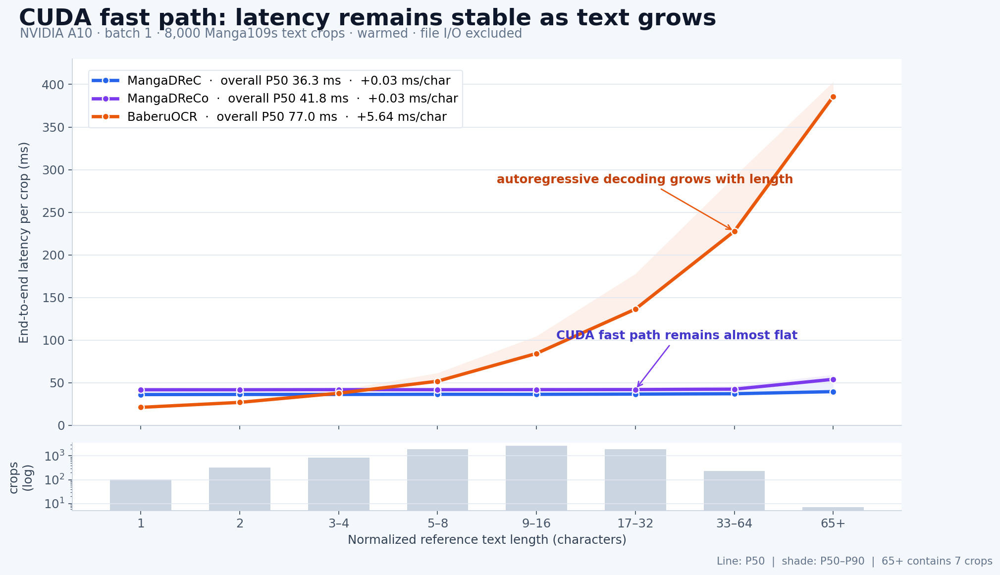

# MangaDReC / MangaDReCo v1

[中文](#中文) · [English](#english)

## 中文

### 定位

MangaDReC/DReCo 面向实时漫画识别：页面到达后，上游提取 text crop；当前页面或
短队列中的 crop 以常见的 batch 1–16 立即送入 OCR。模型处理一个文字区域内部的
检测、阅读顺序、裁剪和识别；整页版面分析由上游完成。

项目目标是达到 BaberuOCR 同档质量，同时在 MPS/CUDA 上取得明确速度优势。当前
质量大体达到同档，CUDA 目标基本实现；MPS 单图速度落后预期。因此，按原定
跨平台目标，v1 是一次失败的实验。

### 版本

| 模型 | 输出 | 参数量 | safetensors |
|---|---|---:|---:|
| [MangaDReC](https://modelscope.cn/models/muscgab/MangaDReC-v1) | CTC greedy | 34.5M | 146.1 MB |
| [MangaDReCo](https://modelscope.cn/models/muscgab/MangaDReCo-v1-Synthetic) | CTC + 受限 NAR 纠错 | 48.1M | 200.6 MB |

DReCo 的 B 是 13.6M 双向 Transformer，编辑范围固定为同一 CTC cell 的 top-16
非标点替换。

源码与文档：[GitHub](https://github.com/muscgab/MangaDReC)。权重同时发布于
[Hugging Face：DReC](https://huggingface.co/muscgab/MangaDReC-v1)、
[Hugging Face：DReCo](https://huggingface.co/muscgab/MangaDReCo-v1-Synthetic) 和上表
ModelScope 仓库。

### 结构

```text
text crop
  -> PP-OCRv6 medium DB DET，固定 224 x 224
  -> A：GPU DB 后处理、阅读顺序、透视裁剪、空检测整图兜底
  -> PP-OCRv6 small REC，48 px，选择最近的 320/480/640 宽度，一次 CTC batch
  -> DReC：greedy IDs
  -> DReCo：120 维 REC evidence + top-16 -> 13.6M NAR B -> 受限替换
```

核心张量路径运行在 MPS/CUDA。Python 接口只在最终 `decode()` 时把 token ID 转成
字符串。NAR 避免逐 token 解码；总耗时仍受 crop 数、DET 框数和 REC 宽度影响。

### 设备后端

两个后端共用同一份 `safetensors` 权重和上层 pipeline。CUDA 使用自定义 CUDA
CCL/DB 解码扩展，并在不采用扩框结果时跳过该分支；MPS 使用 Metal shader 完成
CCL/DB 解码、扩框和阅读顺序。DET、REC 和 B 的网络结构与参数在两个后端一致。

### 训练

- DET：800K 合成图，覆盖横竖排、多 track、Ruby、气泡/图像背景和无文字负例。
- REC：1.25M 合成单 track；约70%竖排、30%横排；包含网点、模糊、压缩、低对比、
  墨迹、出血和裁剪退化。
- B：55M 日文字符语义预训练；200,294 个合成视觉块、2,972,345 个 REC cell，
  其中29,995个错误 cell 的正确字位于 top-16。B 的视觉训练只使用合成图像，未用
  真实漫画图片微调或选择阈值。

B 的语义文本包含 JESC，以及从私有漫画集提取的日文文本。后者先由 MangaOCR
转写，再由 Terra + Luna 修复和过滤。私有漫画图片、原始转写、清洗语料、合成
训练图片和生成器素材均不随模型发布。

### 质量

长度分层的8,000张 Manga109s crop，统一采用
[`v2.1_translation_typography_eval_20260905`](TRANSLATION_PUNCTUATION_V2_1.md)
翻译标点归一化：

| 模型 | EM | CER |
|---|---:|---:|
| MangaDReC | 81.750% | 3.690% |
| MangaDReCo | **83.275%** | 3.480% |
| BaberuOCR | 82.025% | **3.318%** |
| MangaOCR | 81.538% | 3.869% |

MangaOCR 使用 Manga109 派生训练数据，在此评测上存在训练/测试重叠风险。本项目
公开报告的 EM/CER 均以相同的 V2.1 函数对 GT 和预测进行对称归一化，除非表格
明确标记为 raw；原始 OCR 输出保持可用。

### 文本长度与延迟



同一批8,000张、A10、预热后的 batch=1 实测；DReC/DReCo 使用发布包中的 CUDA
fast path。为让三套 OCR 使用同一横轴，按归一化参考文本长度分桶。曲线为 P50，
阴影延伸到 P90。DReC/DReCo 每增加一个字符约增加0.03ms；BaberuOCR 约增加
5.64ms。

### NVIDIA A10：实时 text-crop batch

batch 1 使用长度分层的8,000张；batch 2–16 使用其中固定的1,000张。每项预热10个
完整 batch。图片已解码并常驻内存；计时包含输入 packing、H2D、推理、D2H和文字
解码；模型加载与文件 I/O 位于计时范围外。P50 是整个 batch 的完成时间。

| Batch | DReC P50 | DReCo P50 | BaberuOCR P50 | HayaiOCR v2.1 P50 |
|---:|---:|---:|---:|---:|
| 1 | **36.28 ms** | 41.77 ms | 77.05 ms | — |
| 2 | **35.58 ms** | 40.32 ms | 103.28 ms | 110.94 ms |
| 4 | **36.80 ms** | 42.81 ms | 136.71 ms | 144.85 ms |
| 8 | **53.36 ms** | 57.72 ms | 173.96 ms | 191.90 ms |
| 16 | **85.89 ms** | 92.77 ms | 222.53 ms | 259.84 ms |

保留的 HayaiOCR A10 同口径序列从 batch 2 开始。

### NVIDIA A10：离线最大吞吐

同一批5,120张，每项预热10个完整 batch；逐步增大 batch，保留实测峰值。

| 模型 | 峰值 batch | 峰值吞吐 |
|---|---:|---:|
| MangaDReC | 128 | **216.88/s** |
| BaberuOCR | 256 | 182.36/s |
| HayaiOCR v2.1 | 512 | 154.91/s |
| MangaOCR | 32 | 58.40/s |
| PaddleOCR-VL-For-Manga 0.9B | 256 | 35.35/s |

### Apple M1 Pro MPS：实时 text-crop batch

同一批500张，每项预热10个完整 batch；计时边界与上表一致。HayaiOCR v2.1 使用
官方 PyTorch FP32 贪心生成路径。P50 是整个 batch 延迟。

| Batch | DReC P50 | DReCo P50 | HayaiOCR v2.1 P50 |
|---:|---:|---:|---:|
| 1 | 143.17 ms | 161.00 ms | **115.11 ms** |
| 2 | **181.17 ms** | 198.07 ms | 191.51 ms |
| 4 | **237.15 ms** | 284.09 ms | 302.76 ms |
| 8 | **395.79 ms** | 440.94 ms | 518.20 ms |
| 16 | **534.74 ms** | 1002.71 ms | 949.07 ms |

DReC/DReCo 从 batch 4 起出现明显 MPS 长尾。

### 使用

选择一个变体：

```bash
pip install modelscope
modelscope download --model muscgab/MangaDReC-v1 --local_dir MangaDReC-v1
# 或：modelscope download --model muscgab/MangaDReCo-v1-Synthetic --local_dir MangaDReCo-v1
cd MangaDReC-v1  # DReCo 用户进入 MangaDReCo-v1
pip install -r requirements.txt
```

也可以使用 `hf download muscgab/MangaDReC-v1 --local-dir MangaDReC-v1`；DReCo
将仓库名换成 `muscgab/MangaDReCo-v1-Synthetic`。

```python
import numpy as np
from PIL import Image
import torch

try:
    from manga_dreco import MangaDReCo as OCR
except ImportError:
    from manga_drec import MangaDReC as OCR

ocr = OCR.from_pretrained(device="cuda")  # Apple silicon: "mps"
rgb = np.asarray(Image.open("text_crop.png").convert("RGB"))
h, w = rgb.shape[:2]
images = torch.from_numpy(rgb[..., ::-1].copy()).permute(2, 0, 1)[None].to("cuda")
sizes = torch.tensor([[h, w]], device="cuda")
print(ocr.decode(ocr.forward_gpu(images, sizes))[0])
```

批量输入为已 padding 的 `uint8 BGR [B,3,H,W]`，`sizes` 为每张图的原始 `(H,W)`。

### 限制

- 输入应是 text crop；任意无文字截图需要外部 text-presence gate。
- v1 面向常规主体文字；艺术字、强弯曲文字、logo和极小字留给后续版本。
- 权重采用 `safetensors`，模型图由随包 JSON/YAML 配置重建；TorchScript/ONNX
  导出留给后续版本。

### 许可证

代码和公开权重采用 Apache License 2.0。训练使用的私有漫画图片、转写文本、清洗
语料与合成训练图片不在发布内容中。第三方组件及语料说明见
[`THIRD_PARTY_NOTICES.md`](THIRD_PARTY_NOTICES.md)。

## English

### Scope

MangaDReC/DReCo target real-time manga recognition. An upstream page reader
extracts text crops; crops from the current page or a short queue are sent to
OCR in typical batches of 1–16. The model handles detection, reading order,
cropping, and recognition inside each text region. Upstream software performs
full-page layout analysis.

The project targeted BaberuOCR-class quality with a clear speed advantage on
both MPS and CUDA. Quality is broadly in that range and the CUDA target is
largely met. MPS single-image performance falls far short. Under the original
cross-platform target, v1 is a failed experiment.

### Variants

| Model | Output | Parameters | Safetensors |
|---|---|---:|---:|
| [MangaDReC](https://modelscope.cn/models/muscgab/MangaDReC-v1) | Greedy CTC | 34.5M | 146.1 MB |
| [MangaDReCo](https://modelscope.cn/models/muscgab/MangaDReCo-v1-Synthetic) | CTC + constrained NAR correction | 48.1M | 200.6 MB |

DReCo adds a 13.6M bidirectional Transformer B. Its edit space contains only
non-punctuation replacements from the same CTC cell's top-16 candidates.

Source and documentation: [GitHub](https://github.com/muscgab/MangaDReC).
Weights are mirrored on
[Hugging Face: DReC](https://huggingface.co/muscgab/MangaDReC-v1),
[Hugging Face: DReCo](https://huggingface.co/muscgab/MangaDReCo-v1-Synthetic),
and the ModelScope repositories linked above.

### Architecture

```text
text crop
  -> PP-OCRv6 medium DB DET at 224 x 224
  -> A: GPU DB post-processing, reading order, projective crops, empty-DET fallback
  -> PP-OCRv6 small REC at 48 px; nearest 320/480/640 width; one CTC batch
  -> DReC: greedy IDs
  -> DReCo: 120-D REC evidence + top-16 -> 13.6M NAR B -> constrained replacement
```

Core tensors remain on MPS/CUDA. `decode()` copies final token IDs to construct
strings. NAR removes token-by-token decoding; crop count, DET boxes, and REC
width still affect runtime.

### Device backends

Both backends share one `safetensors` checkpoint and the same high-level
pipeline. CUDA uses a custom CUDA CCL/DB decoder and skips expansion when its
result is not selected. MPS uses Metal shaders for CCL/DB decoding, expansion,
and reading order. DET, REC, and B have identical architecture and parameters
on both backends.

### Training

- DET: 800K synthetic images covering horizontal/vertical text, multiple tracks,
  Ruby, balloons/image backgrounds, and text-free negatives.
- REC: 1.25M synthetic tracks, approximately 70% vertical and 30% horizontal,
  with manga screening, blur, compression, contrast, ink, bleed, and crop noise.
- B: 55M Japanese characters for semantic pretraining; 200,294 synthetic visual
  blocks and 2,972,345 REC cells. B's visual stage uses synthetic images only;
  no real manga image is used for fine-tuning or threshold selection.

B's semantic text contains JESC and Japanese text extracted from a private manga
collection. The latter was initially transcribed by MangaOCR, then repaired and
filtered by Terra and Luna. The private manga images, raw transcripts, cleaned
corpus, synthetic training images, and generator assets are not distributed.

### Quality

The fixed 8,000-crop Manga109s benchmark uses
[`v2.1_translation_typography_eval_20260905`](TRANSLATION_PUNCTUATION_V2_1.md)
for every model.

| Model | EM | CER |
|---|---:|---:|
| MangaDReC | 81.750% | 3.690% |
| MangaDReCo | **83.275%** | 3.480% |
| BaberuOCR | 82.025% | **3.318%** |
| MangaOCR | 81.538% | 3.869% |

MangaOCR uses Manga109-derived training data and has potential train/evaluation
overlap here. Every public EM/CER result applies the same V2.1 function
symmetrically to the ground truth and prediction unless a table is explicitly
marked `raw`. Raw OCR output remains available.

### Text length and latency


The chart uses the same 8,000 warmed, batch-1 A10 measurements. DReC/DReCo use
the release package's CUDA fast path. Normalized reference length provides one
shared x-axis for all three OCR systems. Lines show P50 and bands extend to P90.
DReC/DReCo add about 0.03 ms per character; BaberuOCR adds about 5.64 ms.

### NVIDIA A10: real-time text-crop batches

Batch 1 uses the length-stratified 8,000-crop set; batches 2–16 use a fixed
1,000-crop subset. Every run follows 10 complete warmup batches. Images are
decoded and resident. Timing includes packing/preprocessing, H2D, inference,
D2H, and text decode. Loading and file I/O sit outside the timing boundary. P50
is whole-batch latency.

| Batch | DReC P50 | DReCo P50 | BaberuOCR P50 | HayaiOCR v2.1 P50 |
|---:|---:|---:|---:|---:|
| 1 | **36.28 ms** | 41.77 ms | 77.05 ms | — |
| 2 | **35.58 ms** | 40.32 ms | 103.28 ms | 110.94 ms |
| 4 | **36.80 ms** | 42.81 ms | 136.71 ms | 144.85 ms |
| 8 | **53.36 ms** | 57.72 ms | 173.96 ms | 191.90 ms |
| 16 | **85.89 ms** | 92.77 ms | 222.53 ms | 259.84 ms |

The retained same-protocol HayaiOCR A10 series starts at batch 2.

### NVIDIA A10: peak offline throughput

The same 5,120 crops are measured after 10 complete warmup batches. Batch size
is increased until measured throughput reaches its peak.

| Model | Peak batch | Peak throughput |
|---|---:|---:|
| MangaDReC | 128 | **216.88/s** |
| BaberuOCR | 256 | 182.36/s |
| HayaiOCR v2.1 | 512 | 154.91/s |
| MangaOCR | 32 | 58.40/s |
| PaddleOCR-VL-For-Manga 0.9B | 256 | 35.35/s |

### Apple M1 Pro MPS: real-time text-crop batches

Every run uses the same 500 crops after 10 complete warmup batches, with the
same timing boundary as above. HayaiOCR v2.1 uses its official PyTorch FP32
greedy path. P50 is whole-batch latency.

| Batch | DReC P50 | DReCo P50 | HayaiOCR v2.1 P50 |
|---:|---:|---:|---:|
| 1 | 143.17 ms | 161.00 ms | **115.11 ms** |
| 2 | **181.17 ms** | 198.07 ms | 191.51 ms |
| 4 | **237.15 ms** | 284.09 ms | 302.76 ms |
| 8 | **395.79 ms** | 440.94 ms | 518.20 ms |
| 16 | **534.74 ms** | 1002.71 ms | 949.07 ms |

DReC and DReCo develop large MPS tails from batch 4 upward.

### Usage

Choose one variant:

```bash
pip install modelscope
modelscope download --model muscgab/MangaDReC-v1 --local_dir MangaDReC-v1
# Or: modelscope download --model muscgab/MangaDReCo-v1-Synthetic --local_dir MangaDReCo-v1
cd MangaDReC-v1  # DReCo users enter MangaDReCo-v1
pip install -r requirements.txt
```

Alternatively run `hf download muscgab/MangaDReC-v1 --local-dir MangaDReC-v1`;
use `muscgab/MangaDReCo-v1-Synthetic` for DReCo.

```python
import numpy as np
from PIL import Image
import torch

try:
    from manga_dreco import MangaDReCo as OCR
except ImportError:
    from manga_drec import MangaDReC as OCR

ocr = OCR.from_pretrained(device="cuda")  # use "mps" on Apple silicon
rgb = np.asarray(Image.open("text_crop.png").convert("RGB"))
h, w = rgb.shape[:2]
images = torch.from_numpy(rgb[..., ::-1].copy()).permute(2, 0, 1)[None].to("cuda")
sizes = torch.tensor([[h, w]], device="cuda")
print(ocr.decode(ocr.forward_gpu(images, sizes))[0])
```

Batch input is padded `uint8 BGR [B,3,H,W]`; `sizes` stores each original `(H,W)`.

### Limits

- Input should be a text crop; arbitrary screenshots need an external
  text-presence gate.
- v1 targets regular body text; stylized lettering, strongly curved text, logos,
  and tiny text remain for later versions.
- Weights use `safetensors`; the module graph is rebuilt from bundled JSON/YAML
  configuration. TorchScript/ONNX export remains future work.

### License

Code and released weights are available under the Apache License 2.0. Private
manga images, transcripts, cleaned text, and synthetic training images are not
part of the release. See [`THIRD_PARTY_NOTICES.md`](THIRD_PARTY_NOTICES.md) for
upstream components and corpus attribution.
